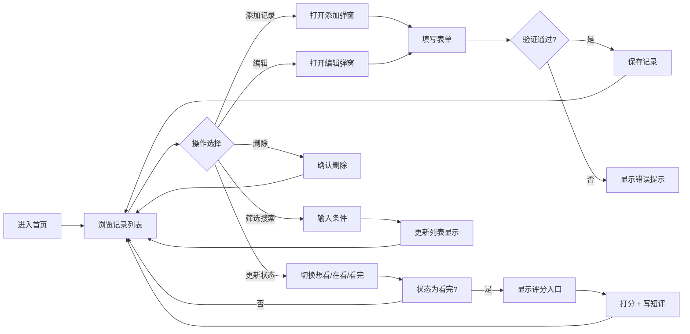

## 1. 产品概述

「追剧追书」是一款个人影视与读书追踪 Web 应用，帮助用户记录想看、在看、已看完的书籍、电影和剧集，建立个人精神生活档案。

- 目标用户：希望系统化记录自己观影、阅读历程的普通用户
- 核心价值：简洁优雅的记录体验，让精神足迹清晰可见
- 设计理念：融中国古典美学于现代交互，如展卷品茗般雅致

## 2. 核心功能

### 2.1 用户角色

| 角色 | 注册方式 | 核心权限 |
|------|----------|----------|
| 普通用户 | 无需注册，本地存储 | 记录管理、状态追踪、评价打分、筛选搜索 |

### 2.2 功能模块

1. **首页**：记录列表展示、筛选搜索、添加记录入口
2. **记录管理**：添加、编辑、删除记录，包含标题、类型、封面、年份、简介
3. **状态追踪**：想看 → 在看 → 看完三态流转
4. **评价系统**：五星打分、短评撰写（仅限已看完状态）
5. **筛选搜索**：按类型筛选、按状态筛选、标题关键词搜索

### 2.3 页面详情

| 页面名称 | 模块名称 | 功能描述 |
|---------|----------|----------|
| 首页 | 顶部导航 | 应用标题、添加记录按钮 |
| 首页 | 筛选栏 | 类型筛选（全部/书/电影/剧）、状态筛选（全部/想看/在看/看完）、搜索框 |
| 首页 | 记录列表 | 卡片式展示所有记录，支持状态更新快捷操作 |
| 添加/编辑弹窗 | 表单区域 | 标题、类型、封面URL、年份、简介输入，表单验证 |
| 记录卡片 | 状态操作 | 状态切换按钮、删除按钮、编辑入口 |
| 记录卡片 | 评分区域 | 五星打分控件、短评展示与编辑（已看完状态可见） |

## 3. 核心流程

## 4. 用户界面设计

### 4.1 设计风格

**中国古典美学风格 —— 「雅韵」**

- **主色调**：
  - 黛青 `#2C3E50`（深青灰，如远山）
  - 月白 `#F5F0E8`（米白，如宣纸）
  - 朱砂 `#C0392B`（朱红，如印泥）
  - 松烟 `#34495E`（深灰，如墨色）
  - 竹青 `#7F8C8D`（灰绿，如竹影）

- **辅色调**：
  - 鎏金 `#D4A017`（金色，用于星级评分）
  - 淡墨 `#95A5A6`（浅灰，用于次要文字）

- **字体选择**：
  - 标题：`"ZCOOL XiaoWei"`, `"Noto Serif SC"`, serif —— 兼具书法韵味与可读性
  - 正文：`"Noto Sans SC"`, `"PingFang SC"`, sans-serif —— 清雅端正

- **视觉元素**：
  - 宣纸纹理背景，淡墨晕染效果
  - 圆角卡片，细边框如古籍线装
  - 印章式状态标签
  - 水墨风格过渡动画
  - 卷轴展开式弹窗效果

- **按钮风格**：
  - 圆润转角（8-12px），淡雅渐变
  - 悬停时有微微浮起效果，如落纸轻弹
  - 主按钮用朱砂色，次按钮用黛青色

- **图标风格**：
  - Lucide 线性图标，统一 18-20px 尺寸
  - 书用书本图标，电影用胶卷图标，剧用显示器图标
  - 状态用眼（想看）、笔（在看）、勾（看完）区分

### 4.2 页面设计概览

| 页面名称 | 模块名称 | UI 元素 |
|---------|----------|---------|
| 首页 | 顶部导航 | 宣纸底色，书法体标题「追剧追书」，朱砂色添加按钮，右侧淡墨分隔线 |
| 首页 | 筛选栏 | 横向标签式筛选，选中项用朱砂下划线，搜索框竹青色边框，搜索图标 |
| 首页 | 记录列表 | 响应式网格布局（桌面 3 列，平板 2 列，移动 1 列），卡片间距 20px |
| 记录卡片 | 封面区域 | 顶部封面图，固定 160px 高度，object-fit: cover，圆角顶部 |
| 记录卡片 | 信息区域 | 月白底色，类型印章式标签（朱砂/黛青/竹青），标题松烟色加粗，年份淡墨色 |
| 记录卡片 | 状态区域 | 三态切换按钮组，当前状态高亮，印章式设计 |
| 记录卡片 | 操作区域 | 编辑、删除图标按钮，悬停显示 |
| 记录卡片 | 评分区域 | 鎏金色星星，点击交互，短评输入框竹青色边框 |
| 添加弹窗 | 遮罩层 | 半透明黛青色，模糊背景 |
| 添加弹窗 | 表单区域 | 卷轴展开动画，月白底色，细竹青边框，标签右对齐，输入框圆角 |
| 添加弹窗 | 底部按钮 | 取消（黛青描边）、保存（朱砂填充），右对齐 |

### 4.3 响应式设计

- **桌面优先**，适配 1280px 及以上
- 断点：1024px（平板横屏）、768px（平板竖屏）、480px（手机）
- 移动端：单列布局，筛选栏改为可折叠，弹窗全屏化
- 触摸优化：按钮最小 44px 触控区域，取消 hover 依赖

### 4.4 动画与交互

- 页面加载：记录卡片错落淡入（staggered fade-in），如卷轴渐展
- 状态切换：印章按下回弹效果
- 评分：星星点亮动画，鎏金色渐变
- 弹窗：卷轴展开/收起动画
- 删除：确认弹窗淡出，卡片渐隐移除
- 搜索输入：实时过滤，列表平滑更新
