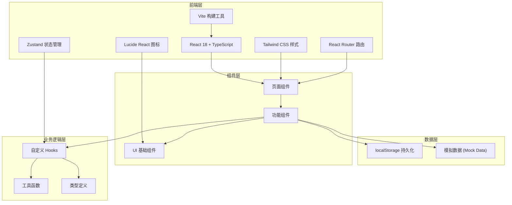
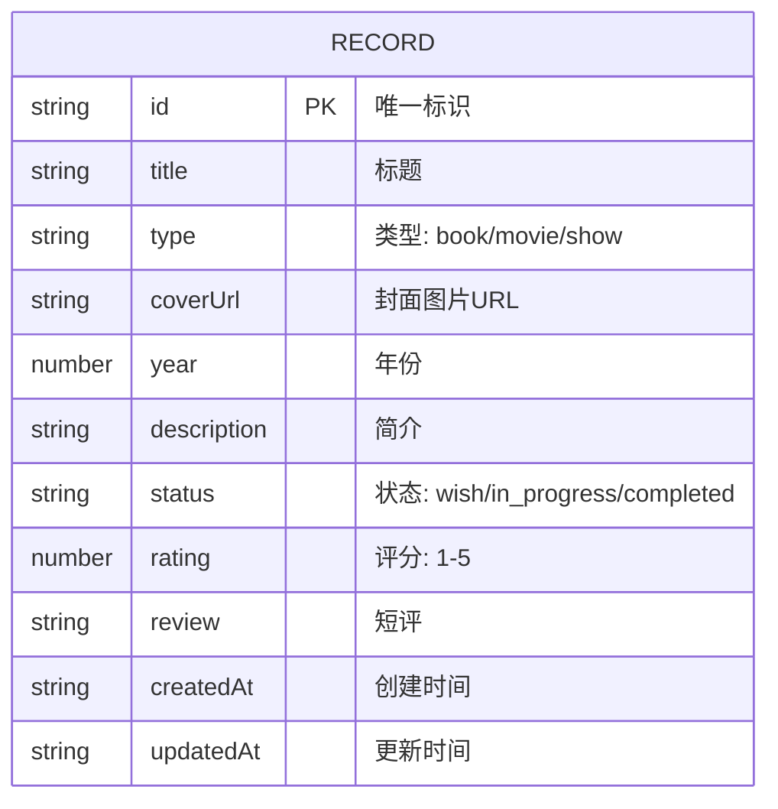

## 1. 架构设计



## 2. 技术选型说明

| 技术 | 版本 | 用途 | 选型理由 |
|------|------|------|----------|
| React | 18.x | UI 框架 | 组件化开发，生态成熟，Hooks 优雅 |
| TypeScript | 5.x | 类型系统 | 类型安全，减少运行时错误，IDE 支持好 |
| Vite | 5.x | 构建工具 | 极速冷启动，HMR 秒级更新，配置简洁 |
| Tailwind CSS | 3.x | CSS 框架 | 原子化 CSS，开发效率高，易于定制主题 |
| Zustand | 4.x | 状态管理 | 极简 API，无 Provider 嵌套，TypeScript 友好 |
| React Router | 6.x | 路由管理 | 声明式路由，嵌套路由，loaders/actions |
| Lucide React | 0.x | 图标库 | 线性风格统一，开源免费，按需引入 |
| localStorage | - | 数据持久化 | 无需后端，浏览器原生支持，适合个人应用 |

## 3. 项目目录结构

```
├── src/
│   ├── components/          # 可复用组件
│   │   ├── ui/             # 基础 UI 组件 (Button, Input, Modal 等)
│   │   │   ├── Button.tsx
│   │   │   ├── Input.tsx
│   │   │   ├── Modal.tsx
│   │   │   ├── Select.tsx
│   │   │   ├── Textarea.tsx
│   │   │   └── StarRating.tsx
│   │   ├── RecordCard.tsx  # 记录卡片组件
│   │   ├── RecordForm.tsx  # 添加/编辑表单组件
│   │   ├── FilterBar.tsx   # 筛选栏组件
│   │   └── Header.tsx      # 顶部导航组件
│   ├── pages/              # 页面组件
│   │   └── Home.tsx        # 首页
│   ├── store/              # 状态管理
│   │   └── useRecordStore.ts
│   ├── hooks/              # 自定义 Hooks
│   │   └── useLocalStorage.ts
│   ├── utils/              # 工具函数
│   │   ├── validation.ts   # 表单验证
│   │   └── constants.ts    # 常量定义
│   ├── types/              # TypeScript 类型定义
│   │   └── index.ts
│   ├── mock/               # 模拟数据
│   │   └── initialData.ts
│   ├── App.tsx             # 根组件
│   ├── main.tsx            # 入口文件
│   └── index.css           # 全局样式与 Tailwind 指令
├── public/                 # 静态资源
├── .trae/documents/        # 项目文档
├── index.html
├── package.json
├── tsconfig.json
├── vite.config.ts
├── tailwind.config.js
├── postcss.config.js
└── README.md
```

## 4. 路由定义

| 路由路径 | 页面组件 | 功能说明 |
|---------|----------|----------|
| `/` | `Home.tsx` | 首页，展示记录列表、筛选搜索、添加入口 |

> 本应用为单页应用，所有交互通过弹窗/模态框完成，无需多页面路由。

## 5. 数据模型

### 5.1 ER 图



### 5.2 TypeScript 类型定义

```typescript
export type RecordType = 'book' | 'movie' | 'show';
export type RecordStatus = 'wish' | 'in_progress' | 'completed';

export interface Record {
  id: string;
  title: string;
  type: RecordType;
  coverUrl?: string;
  year?: number;
  description?: string;
  status: RecordStatus;
  rating?: number; // 1-5, 仅 status === 'completed' 时可设置
  review?: string; // 仅 status === 'completed' 时可设置
  createdAt: string;
  updatedAt: string;
}

export interface RecordFormData {
  title: string;
  type: RecordType;
  coverUrl?: string;
  year?: number;
  description?: string;
}

export interface FilterOptions {
  type: RecordType | 'all';
  status: RecordStatus | 'all';
  searchKeyword: string;
}
```

### 5.3 常量定义

```typescript
export const RECORD_TYPES = [
  { value: 'book', label: '书', color: 'cinnabar', icon: 'BookOpen' },
  { value: 'movie', label: '电影', color: 'daiqing', icon: 'Film' },
  { value: 'show', label: '剧', color: 'zhuqing', icon: 'Monitor' },
] as const;

export const RECORD_STATUSES = [
  { value: 'wish', label: '想看', icon: 'Eye' },
  { value: 'in_progress', label: '在看', icon: 'PenTool' },
  { value: 'completed', label: '看完', icon: 'Check' },
] as const;

export const STORAGE_KEY = 'zhui-ju-zhui-shu-records';
```

## 6. 状态管理 (Zustand Store)

```typescript
interface RecordState {
  records: Record[];
  filters: FilterOptions;
  addRecord: (data: RecordFormData) => void;
  updateRecord: (id: string, data: Partial<Record>) => void;
  deleteRecord: (id: string) => void;
  updateStatus: (id: string, status: RecordStatus) => void;
  updateRating: (id: string, rating: number, review?: string) => void;
  setFilters: (filters: Partial<FilterOptions>) => void;
  getFilteredRecords: () => Record[];
  loadFromStorage: () => void;
}
```

## 7. 表单验证规则

| 字段 | 规则 | 错误提示 |
|------|------|----------|
| 标题 | 必填，长度 1-100 字符 | "请输入标题（1-100字）" |
| 类型 | 必填，为 book/movie/show 之一 | "请选择类型" |
| 封面URL | 可选，如填写需为有效URL格式 | "请输入有效的图片URL" |
| 年份 | 可选，如填写需为 1900-2100 之间的整数 | "请输入有效的年份（1900-2100）" |
| 简介 | 可选，最多 500 字符 | "简介不能超过500字" |
| 评分 | 仅"看完"状态可填，1-5 整数 | "请选择1-5星评分" |
| 短评 | 仅"看完"状态可填，最多 200 字符 | "短评不能超过200字" |

## 8. 性能与质量保障

### 8.1 性能优化
- 列表虚拟滚动（如记录超过 100 条）
- 图片懒加载 `loading="lazy"`
- React.memo 优化列表项重渲染
- Zustand 选择器优化订阅粒度

### 8.2 代码质量
- ESLint + Prettier 代码规范
- TypeScript 严格模式
- 组件单一职责，每个组件 < 300 行
- 自定义 Hook 提取复用逻辑

### 8.3 测试策略
- 工具函数单元测试 (Vitest)
- 表单验证逻辑测试
- 状态管理 store 测试
- 关键组件快照测试

### 8.4 浏览器兼容性
- 支持 Chrome/Edge/Firefox/Safari 最新两个版本
- 使用 autoprefixer 处理 CSS 前缀
- 优雅降级处理不支持的特性
